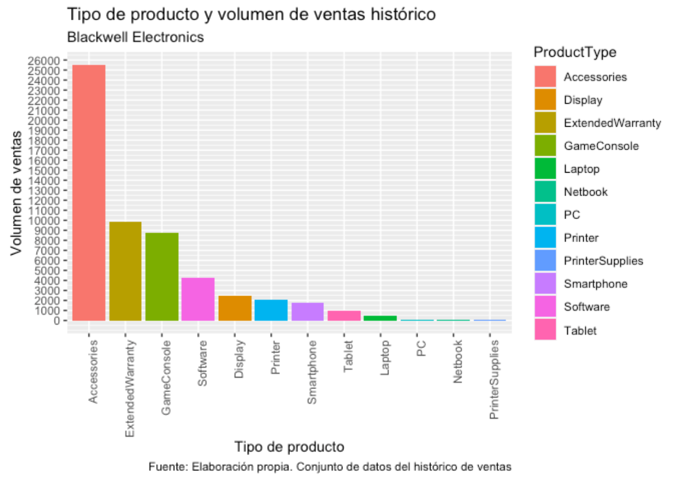

```{r setup, include=FALSE}
knitr::opts_chunk$set(echo = FALSE, message = FALSE, warning = FALSE )
```

```{r , librerias}
library(dplyr)
library(tidyverse)
library(kableExtra)

library(arules)
library(arulesViz)

library(ggrepel)
# ??arules
```

```{r}
dire<-getwd()
setwd(dire)
```

# Introducción (definición del problema + objetivos)

## Objetivos

La junta directiva de Blackwell Electronics está considerando adquirir una empresa minorista de productos electrónicos, **Electronidex**.

Los objetivos del estudio que vamos a realizar vienen detallados a continuación:

-   Identificar patrones de compra o relaciones entre artículos que proporcionen información sobre la clientela de Electronidex
-   ¿Se beneficiaría Blackwell de vender alguno de los artículos de Electronidex?
-   ¿Debería Blackwell adquirir Electronidex?
-   Si Blackwell adquiere Electronidex, ¿tiene alguna recomendación para Blackwell? (Por ejemplo: artículos de venta cruzada, promociones de rebajas, en caso de que eliminen artículos, etc.)

Para ello, realizaremos un *análisis de cesta de la compra* para descubrir los patrones de compra existentes en la clientela de Electronidex y tratar así de identificar las relaciones existentes entre productos a la hora de comprar.

## Qué encontraremos en este informe (procedimiento para cumplir mis objetivos)

-   Descripción de los datos y del dataset
-   Aplicación del algoritmo a priori para crear un modelo con reglas
-   Análisis de las reglas
-   Conclusiones y recomendaciones (Por ejemplo: artículos de venta cruzada, promociones de rebajas, en caso de que eliminen artículos, etc.)
-   Al final del documento encontramos un anexo con la explicación de las métricas usadas y una tabla con información sobre los productos y el volumen de ventas de Electronidex.

# Lectura de datos y descripción del dataset

Los datos se encuentran en formato CSV (formato Basket) y contienen información correspondiente a todas las transacciones online que se han realizado durante un mes en la empresa Electronidex.

Debido a la falta de financiación, Electronidex solo puede extraer datos sobre los artículos que los clientes compraron por sus transacciones.

```{r }
# Para leer los datos en el formato correcto usamos la función read.transactions()
# No podemos abrir nuestro archivo _.csv_ con la función read.csv, ya que no tenemos un dataframe con  variables, sino que tenemos un dataset en formato "basket", donde encontramos una fila por cada compra  realizada y en las columnas los artículos correspondientes a cada compra.

transactions<- read.transactions('ElectronidexTransactions2017/ElectronidexTransactions2017.csv', 
                                       format = c("basket"), sep = ",", 
                                       rm.duplicates = TRUE, skip = 0, 
                                       encoding = "readLines")
# transactions
```

Veamos un breve resumen de las ventas mensuales de Electronidex.

```{r }
summary(transactions)
```

```{r}
n<- length(transactions)
# cat("Tenemos un total de: ",n," transacciones.")
# Nota: es redundante, ya lo tengo en el summary.
```

Los datos contienen un total de `r n` transacciones, de las cuales podemos destacar lo siguiente:

-   Media de 4.4 productos por cada transacción
-   Numero máximo de productos en una transacción: 30 items

No tenemos información sobre cuántos items de cada producto se han vendido, únicamenete tenemos una cota inferior del número de ventas para cada producto. Es decir, sabemos en cuantas transacciones aparece cada producto, pero no cuántas unidades se han vendido en total para cada producto.

Por ejemplo, el producto más frecuente es un iMac, que ha aparecido en 2519 transacciones, eso no significa que únicamente se hayan vendido 2519 unidades de este producto, ya que en una transacción podrían haberse comprado varios.

Productos más frecuentes:

| Producto             | Cota inferior de unidades vendidas |
|----------------------|------------------------------------|
| iMac                 | 2519                               |
| HP Laptop CYBERPOWER | 1909                               |
| Gamer Desktop        | 1809                               |
| Apple Earpods        | 1715                               |
| Apple MacBook Air    | 1530                               |
| Other                | 33622                              |

: Productos más frecuentes

A continuación vamos a ver una lista con algunas transacciones:

```{r}
LIST(transactions) %>% head(10)
```

Parece que en todas las transacciones hay al menos, un ordenador, y en la mayoría encontramos varios equipos de ordenador.

## Productos vendidos por Electronidex

```{r}
ElectronideX<-cbind.data.frame( itemLabels(transactions),
                  itemFrequency(transactions,type="absolute"))
ElectronideX<-cbind.data.frame(ElectronideX[,1],
                 ElectronideX[,2])
colnames(ElectronideX)<-c("Producto","Ventas")
```

Los productos vendidos por Electronidex son:

```{r}
itemLabels(transactions) %>% 
  kable(booktabs=TRUE, caption = "Productos de Electronidex",longtable=TRUE,col.names = "Producto") %>% 
  kable_styling(latex_options = c("stripped","repeat_header"))
```

```{r}
ElectronideX<-ElectronideX %>%
  mutate(ProductType = case_when(
    grepl("Display",ElectronideX$Producto,fixed=T) ~ "Display",
    grepl("Laptop",ElectronideX$Producto,fixed=T)~ "Laptop",
    grepl("TV",ElectronideX$Producto,fixed=T)~"TV" ,
    grepl("Monitor",ElectronideX$Producto,fixed=T)~ "Monitor",
    grepl("iMac",ElectronideX$Producto,fixed=T)~ "Monitor",
    grepl("Desktop",ElectronideX$Producto,fixed=T)~"PC" ,
    grepl("PC",ElectronideX$Producto,fixed=T)~"PC" ,
    grepl("Laptop",ElectronideX$Producto,fixed=T)~"Laptop" ,
    grepl("MacBook",ElectronideX$Producto,fixed=T)~ "Laptop",
    grepl("Acer Aspire",ElectronideX$Producto,fixed=T)~ "Laptop",
    grepl("Chromebook",ElectronideX$Producto,fixed=T)~ "Laptop",
    grepl("Printer",ElectronideX$Producto,fixed=T)~ "Printer",
    grepl("Tablet",ElectronideX$Producto,fixed=T)~ "Tablet",
    grepl("iPad",ElectronideX$Producto,fixed=T)~ "Tablet",
    grepl("Netbook",ElectronideX$Producto,fixed=T)~"Netbook" ,
    grepl("Smartphone",ElectronideX$Producto,fixed=T)~ "Smartphone",
    grepl("Software",ElectronideX$Producto,fixed=T)~ "Software",
    grepl("HP Notebook Touchscreen Laptop PC",ElectronideX$Producto,fixed=T)~ "Laptop",
    grepl("Ink",ElectronideX$Producto,fixed=T)~ "PrinterSupplies",
    grepl("Toner",ElectronideX$Producto,fixed=T)~ "PrinterSupplies",
    
    ))
ElectronideX[is.na(ElectronideX$ProductType),3] <-"Accessories"
```

## Análisis de ventas

Vamos a visualizar a través de un histograma los 20 productos que han aparecido en más transacciones.

```{r}
itemFrequencyPlot(transactions,topN=20,
                  type="absolute",
                  col = rainbow(4))
```

A continuación, mostramos dos gráficos de barras, uno con el volumen de ventas del último mes de los productos de Electronidex, clasificados previamente por tipo de producto y otro gráfico con el volumen histórico de ventas de Blackwell Electronics.

```{r}
ggplot(data=ElectronideX, 
       aes(x=reorder(ProductType,Ventas) , 
        y = Ventas , fill= ProductType)) + 
    geom_bar(stat="identity", position="dodge") +
   scale_y_continuous(breaks = seq(0,2500,by=200))+
    labs(title="Tipo de producto y volumen de ventas del último mes" ,
         subtitle= "Electronidex", 
         caption="Fuente: Elaboración propia. Conjunto de datos de transacciones"
        )+
  xlab("Tipo de producto")+
  ylab("Volumen de Ventas")+
  theme(axis.text.x = element_text(angle = 60, hjust = 1))
```



El producto más vendido por Electronidex es el iMac, se trata de un ordenador PC y en un mes se han vendido como mínimo 2519 unidades. Blackwell vende 4 tipos de PC y el total de ventas histórico de este tipo de producto ha sido un total de *116* unidades. Solo con el modelo iMac, las ventas de ordenadores PC en un mes de Electronidex ya supera con mucha diferencia a la venta histórica de los de Blackwell.

Además, entre los productos más vendidos también encontramos otros modelos de ordenadores PC, entre ellos: Lenovo Desktop Computer, Dell Desktop, ViewSonic Monitor, Acer Desktop... Las cotas inferiores de ventas de estos productos son todas superiores a las 1000 unidades. Con esto concluímos que se han vendido más de 7000 unidades de este tipo de ordenador en un único mes, mientras que la venta histórica de Blackwell del mismo tipo de producto, ha sido de *116 uds*.

Ocurre lo mismo con los ordenadores portátiles. El histórico de ventas de Blackwell es de 516 unidades, mientras que en Electronidex, el portatil más vendido es el modelo HP Laptop, con un mínimo de ventas de 1909 artículos. Con un único producto, Electronidex ha vendido casi el cuádruple de productos en un único mes que Blackwell en toda su historia. Entre los productos más vendidos, encontramos también otros dos modelos de portatil, el Acer Aspire (814 ventas) y Dell Laptop (776 ventas).

Destacar también que en los productos más vendidos, encontramos varios modelos de teclados, son productos de tipo accesorios. Backlit LED Gaming Keyboard (785), Apple Magic Keyboard (705), Apple Wireless Keyboard (638). Sin embargo, esto son accesorios, y Blackwell ha vendido más de 250000 artículos de tipo accesorio en toda su historia, pero no tenemos información sobre el modelo de estos productos.

*Nota*: Entre paréntesis aparecen las cotas inferiores de ventas.

# Aplicación del algoritmo a priori

## Algoritmo

```{r}
# apriori() function to apply the Apriori algorithm to find association rules.
RulesName<-apriori (transactions, 
                    parameter = list(supp = 0.01,
                                     conf = 0.5,
                                     minlen=2,
                                     maxlen=30,
                                     # Se especifica que se creen reglas
                                      target = "rules"
                                     ))


```

```{r}
 # To view the rules, use the inspect() function. 
inspect(RulesName)
```

El algoritmo nos está recomendando comprar el ordenador iMac y el portatil \_HP laptop\_ en todas las reglas. Se trata de los dos productos más vendidos, por lo que no tiene sentido. Estos productos no tienen problemas para su venta, por lo que nuestro objetivo es buscar reglas que recomienden productos que se han vendido en menor volumen.

Para ello, vamos a modificar las reglas, bajando el valor de la confianza y obligando al algoritmo a tener los productos más frecuentes a la izquierda.

Veamos las nuevas reglas de asociación:

```{r}
rules <- apriori (data=transactions, 
                       parameter=list (supp=0.01,
                                       conf = 0.15,
                                       minlen=2,
                                       # Se especifica que se creen reglas
                                       target = "rules"), 
                       appearance = list(default="rhs",
                       lhs=c("iMac","HP Laptop","CYBERPOWER Gamer Desktop"  ,
                             "Dell Desktop",
                             "ViewSonic Monitor",
                             "Lenovo Desktop Computer",
                             "Acer Desktop", "Acer Aspire", 
                             "Apple Earpods","Apple Magic Keyboard","Apple MacBook Pro"
                             ) ), 
                  control = list (verbose=F)) 
inspect(rules)
# el problema es confident, es baja
# Para buscar itemsets, fuerzo la conbinación de productos
# "iMac","ViewSonic Monitor" conbinación interesante
```

Se han encontrado 8 reglas, la mayoría d ellas formadas por 2 items en el antecedente (un total de 5 reglas). El resto de reglas tiene 3 items en el antecedente. El frecuente la compra de dos equipos en la misma transacción.

Vamos a ordenar las reglas según la confianza, en orden decreciente:

```{r}
rules_conf <- sort (rules, by="confidence", decreasing=TRUE) 
# 'high-confidence' rules.
inspect((rules_conf))
# en rhs me van saliendo los tops


# Para representarlos con ggplot se convierte a dataframe 
as(rules_conf, Class = "data.frame") %>%
  ggplot(aes(x = reorder(rules, confidence), y = confidence)) +
  geom_col() +
  coord_flip() +
  labs(title = "Confidence", x = "itemsets") +
  theme_bw()
```

Vamos a reordenar las reglas en función del soporte.

Soporte: \*frecuencia con que los objetos son comprados juntos\*.

```{r}
topSup <- sort(rules, by = "support", decreasing = TRUE)
inspect(topSup)


# Para representarlos con ggplot se convierte a dataframe 
as(topSup, Class = "data.frame") %>%
  ggplot(aes(x = reorder(rules, support), y = support)) +
  geom_col() +
  coord_flip() +
  labs(title = "Itemsets más frecuentes", x = "itemsets") +
  theme_bw()
```

Con esta ordenación observamos lo siguiente: los artículos que se han vendido juntos con mayor frecuencia son una torre de ordenador para gamers y una pantalla de ordenador Samsung, ocupando el 3.1% de la frecuencia en las transacciones.

Destacar tambien, con una frecuencia de compra del 2.99%, los productos Apple Earpods y Mackboos Air

Al comprar un portatil HP y un iMac se vende el paquete offfice con una frecuencia del 1.29%.

## Evaluación del modelo

Veamos un resumen de las reglas encontradas, con las siguientes métricas:

-   Support: 0.01

-   Confidence: 0.20

```{r}
summary(rules)
```

Si los valores de support y confidence están próximos a los ajustados, revisar.

Métricas:

-   Support:

    -   Valor medio: 0.0185

    -   Valor mínimo: 0.01

    -   Valor máximo: 0.031

-   Confidence:

    -   Valor medio: 0.17

    -   Valor máximo: 0.21

    -   Valor mínimo: 0.15

El valor de lift mide la importancia y robustez de una regla. Un valor alto de esta métrica indica que la regla es importante:

-   Valor medio: 2.31

-   Valor máximo: 3.21

-   Valor mínimo: 1.10

La regla con mayor valor de lift, y por tanto, mayor robustez es la siguiente:

```{r}
inspect( sort(rules, by = "lift", decreasing = TRUE)[1] ) %>% kable(booktabs=TRUE) 
```

La regla más robusta que hemos encontrado es la venta de un iMac y un Lenovo Desktop que hacen que se compre un ASUS 2 Monitor. Esta compra se ha producido en un total de 107 transacciones (frecuencia: 1.08%)

La transacción que más veces se ha repetido es:

```{r}
inspect( sort(rules, by = "count", decreasing = TRUE)[1] ) %>% kable(booktabs=TRUE) 
```

Al comprar una torre gamer, compramos un monitor Samsung. Esta compra se ha producido un total de 305 veces (3.10%), pero no es muy robusta.

```{r}
filtrado_transacciones <- subset(x = transactions,
                                 subset = items %ain% c("CYBERPOWER Gamer Desktop",
                                                        "Samsung Monitor"))
filtrado_transacciones
```

Vamos a mostrar algunas de las 305 transacciones en las que aparece esta dupla de productos:

```{r}
inspect(filtrado_transacciones[1:5])
```

Vemos que la dupla iMac y HP Laptop se repite en varias transacciones para la influencia de compra de otros productos.

```{r}
filtrado_transacciones2 <- subset(x = transactions,
                                 subset = items %ain% c("iMac",
                                                        "HP Laptop"))
filtrado_transacciones2
```

Estos dos items juntos se venden en 743 transacciones.

Vamos a mostrar algunas de estas transacciones

```{r}
inspect(filtrado_transacciones2[1:5])
```

La regla con mayor confianza es:

```{r}
inspect( sort(rules, by = "confidence", decreasing = TRUE)[1] ) %>% kable(booktabs=TRUE) 
```

Se ha producido un total de 225 veces.

```{r}
metricas <- interestMeasure(rules, measure = c("coverage", "fishersExactTest"),
                            transactions = transacciones)
quality(rules) <- cbind(quality(rules), metricas)
# inspect(sort(x = reglas, decreasing = TRUE, by = "confidence"))
df_reglas <- as(rules, Class = "data.frame") 
df_reglas %>% as.tibble() %>% arrange(desc(confidence)) %>% head()
```

## Mejorar el modelo

```{r}
ItemRules <- subset(rules, items %in% "iMac")
inspect(ItemRules)
```

```{r}
is.redundant(rules_conf,measure="confidence")
```

El algoritmo no presenta reglas redundantes.

## Representación gráfica de las reglas

```{r}
plot(rules_conf, method="graph", 
     control=list(type="items")
     #limit =100 
     )
```

Muchas reglas van hacia Lenovo desktop Computer

```{r}
plot(rules, method="paracoord", control=list(reorder=TRUE))
```

Vemos claramente que las reglas van en dirección a los productos de tipo monitor

## Análisis final de las reglas

Vamos a dividir las reglas en tres categorías:

### Reglas maximales

-   Reglas maximales: debe contener las reglas más útiles

```{r}
reglas_maximales <- rules[is.maximal(rules)]
reglas_maximales
```

Todas las reglas son maximales

### Reglas redundantes

-   Reglas redundantes: reglas que no son útiles o son obvias. Dos reglas son idénticas si tienen el mismo antecedente (parte izquierda) y consecuente (parte derecha). Supongamos ahora que una de estas reglas tiene en su antecedente los mismos items que forman el antecedente de la otra, junto con algunos items más. La regla más genérica se considera redundante, ya que no aporta información adicional

```{r}
reglas_redundantes <- rules[is.redundant(x = rules, measure = "confidence")]
reglas_redundantes
```

No se detectan reglas redundantes

### Reglas poco claras

-   Reglas poco claras: reglas que son indescifrables y, por lo tanto, de las que no se pueden sacar conclusiones claras

Nota: las reglas de asociación son descubrimientos interesantes o fuentes de información, NO predicciones.

# Conclusiones y recomendaciones

**¿Qué compran los clientes de Electronidex?**

Con el estudio y el análisis de las transacciones, se ha observado el siguiente patrón de venta: En gran número de transacciones se compran dos o incluso tres equipos de ordenador, lo que nos hace pensar que la clientela de Electronidex son empresarios o pequeños negocios que necesitan más de un equipo. Cabría pensar que existe una parte de la clientela dedicada al mundo de los videojuegos, ya que la transacción de mayor frecuencia es una que involucra un monitor y una torre gamer. Estudiando estas transacciones, observamos la que también se han comprado, además de estos productos, otros accesorios específicos como ratones gamers o auriculares especializados, sets gamers y videojuegos

También, hemos observado que el **volumen de ventas** de algunos artículos de **Electronidex** como PCs, ordenadores portátiles o monitores, es mucho **más elevado** que el de Blackwell Electronix.

Con respecto a los accesorios, Blackwell vente una cantidad inmensa de este tipo de productos, pero las ventas de Electronidex en cuanto a accesorios no son bajas, han aparecido 15968 artículos que son accesorios en las transacciones, sin olvidar que se trata de transacciones en un único mes y que se trata de una cota inferior. Además, hemos visto patrones de compra donde ser recomiendan accesorios.

Por estos motivos, no vemos necesario eliminar productos de Electronidex, ya que no tenemos información de que accesorios vende Blackwell concretamente, ni si son los mismo que Electronidex.

**Algunas recomendaciones:**

Podría ser interesante crear algún período de rebajas para impulsar las ventas, de tal forma que se hagan ofertas y descuentos. Algunas de estas ofertas podrían ser descuentos en accesorios para impulsar su venta, o bien ofertas del tipo 2x1 o 3x2 con el fin de que haya un aumento en las ventas de aquellos productos que no se venden tanto o bien atraer a clientes nuevos y ampliar así la clientela.

Hemos hecho un estudio de análisis de cesta de la compra para Electronidex, pero también sería interesante hacer este estudio para los productos a la venta en Blackwell, ya que nos ayudaría a encontrar patrones de compra y relaciones de compra de productos.

Por todo lo comentado anteriormente, se **recomienda que Blackwell Electronix adquiera Electronidex**, ya que esto abriría paso a una nueva clientela y a un nuevo abanico de productos, incrementando en gran medida el volumen de ventas, sobretodo de ordenadores portátiles, PCs y monitores. Blackwell debería comprar Electronidex.

# Anexo

## Métricas de asociación para el análisis de cesta de la compra

### Support - Soporte

Frecuencia de un conjunto de productos (X,Y) en todas las transacciones. Frecuencia con la que una persona compra esos X,Y productos al mismo tiempo.

Esta medida se calcula aplicando la regla de laplace:

(casos favorables)/casos posibles

-   Casos favorables: transacciones en las que aparecen los dos productos

-   Casos posibles: todas las transacciones

-   Límites: 0 (no aparecen juntos nunca) y 1 (en todas las transacciones he comprado esos dos productos).

A mayor soporte, habrá mas transacciones en las que se han comprado estos productos juntos

### Confidence - Confianza

$$C(X->Y) = \dfrac{\text{Transacciones que contienen a X y a Y}}{ \text{transacciones que contienen sólo a X}}
$$

Probabilidad de que al comprar el artículo X compre también el artículo Y. Cuanto mayor confianza, mayor probabilidad de que al comprar X compre Y

-   Límites: 0 (al comprar X la probabilidad de comprar Y es nula, no lo voy a comprar) y 1 (si al comprar X sé seguro que voy a compar el producto Y). Son casos extremos

### Lift

Este parámetro mide la frecuencia de compra de ambos / probabilidad de comprar X \* probabilidad de cobrar Y

Mide la robustez de las reglas (strength)

### Tabla de frecuencia de venta de cada producto de Electronidex

En la tabla que se muestra a continuación, podemos ver una lista con los 125 productos que se han vendido, la cota inferior de ventas, la frecuencia relativa de venta y el tipo de producto.

```{r}
ElectronideX%>% kable(booktabs=TRUE,caption = "Productos de Electronidex") %>% kable_styling(latex_options = "striped")
```
